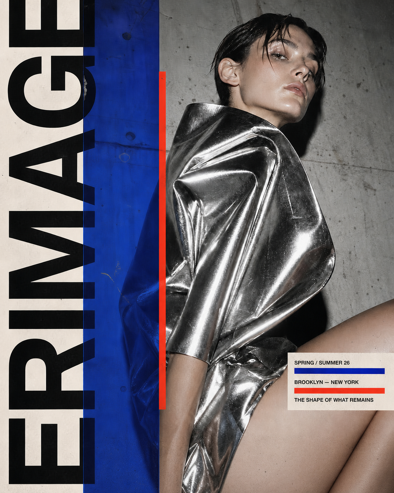
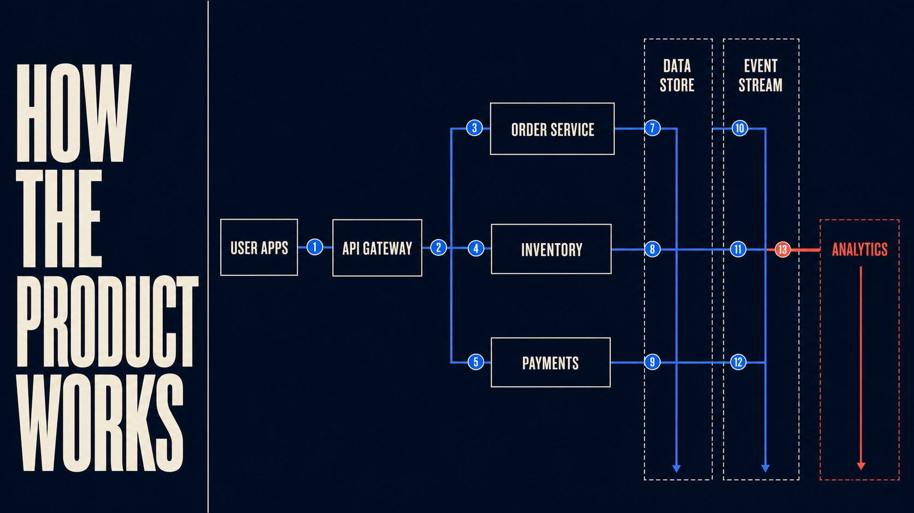

# Aixio Image to Layer — example inputs

These existing Aixio marketing assets illustrate images users can submit to Aixio Image to Layer. They are source images, not screenshots of successful decomposition. Source manifests record `sources-ready-awaiting-live-layer-runs`.

## Campaign poster — input

Example prompt: “Use Aixio Image to Layer to convert this poster into editable layers. Report the returned image/text layers and any fallback.”

## Product architecture diagram — input

Example prompt: “Use Aixio Image to Layer on this diagram. Show the returned text, layer positions and stacking order.”

Before a result showcase is published, capture a successful live job, its ordered layer output, editable counts and fallback flag. Pair each original image with the actual editor screenshot; never fabricate a layer stack or editable text. Supporting media models may create inputs but are not represented as Aixio-owned models.
